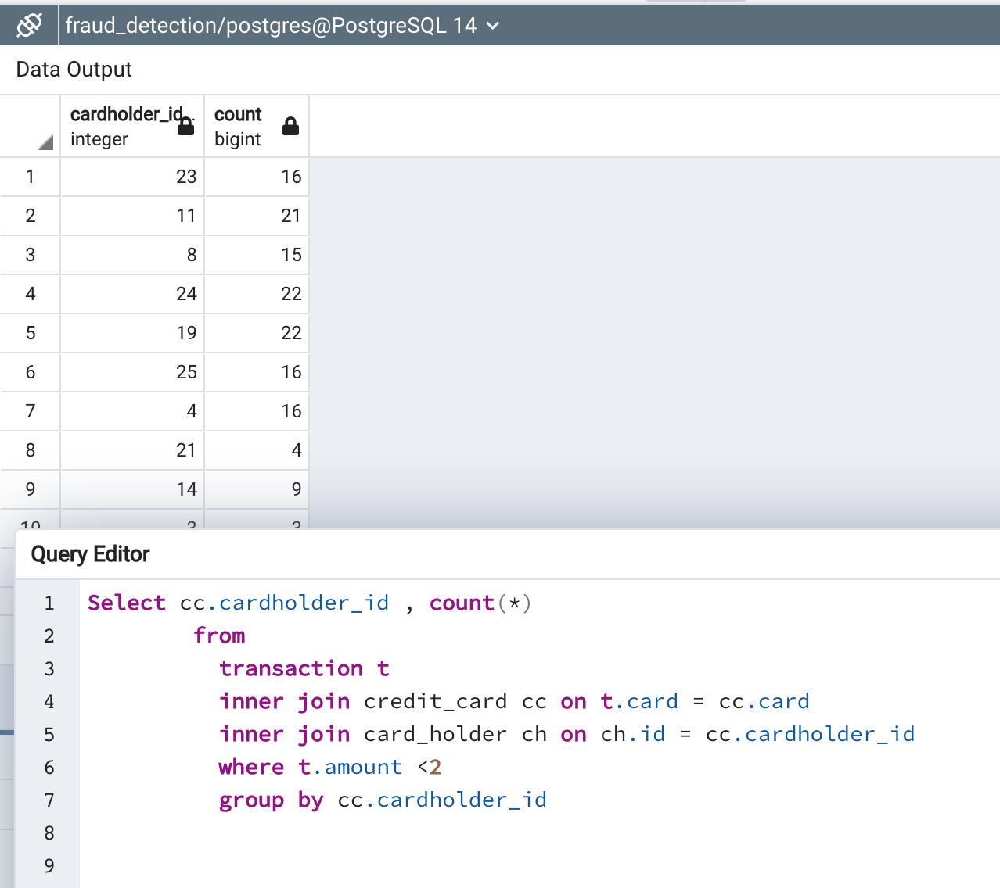

# 07_SQL
Use SQL to analyze historical credit card transactions and consumption patterns in order to identify possible fraudulent transactions

### Data Analysis

***How can you isolate (or group) the transactions of each cardholder
- We can group by cardholder_id to get the count of transactions made by each cardholder
```
Select cc.cardholder_id , count(*)
        from 
          transaction t 
          inner join credit_card cc on t.card = cc.card 
          inner join card_holder ch on ch.id = cc.cardholder_id 
		  group by cc.cardholder_id
		  
```


***Count the transactions that are less than $2.00 per cardholder

To get the transactions less than $2.00 we need to filter the transactions by amount <2 and then group the transactions by card holder id
```
Select cc.cardholder_id , count(*)
        from 
          transaction t 
          inner join credit_card cc on t.card = cc.card 
          inner join card_holder ch on ch.id = cc.cardholder_id 
		  where t.amount <2
		  group by cc.cardholder_id
```



***Is there any evidence to suggest that a credit card has been hacked? Explain your rationale.***
We could check what is the normal amount of spending for a card and then check if there are any transactions that are less than 2$
e.g if the normal sepending is usally between $4 to $100 and we see many transactions less than $2 in a certain period , 
it could indicate that that credit card has been hacked in that period


***Take your investigation a step futher by considering the time period in which potentially fraudulent transactions are made.

***What are the top 100 highest transactions made between 7:00 am and 9:00 am?


```
Select  t.*,date_part('hour',t.date), mc.name
        from 
          transaction t 
          inner join credit_card cc on t.card = cc.card 
          inner join card_holder ch on ch.id = cc.cardholder_id 
		  inner join merchant m on t.id_merchant = m.id 
		  inner join merchant_cat mc on m.id_merchant_category = mc.id 
		 where  date_part('hour',t.date) >= 7  and date_part('hour', t.date) <=9
		 order by t.amount desc
```


***Do you see any anomalous transactions that could be fraudulent?
- The high amount of transactions early morning in a bar/pub seems fraudulant to me


***If you answered yes to the previous question, explain why you think there might be fraudulent transactions during this time frame.***
People would usually leave bar by late night and not be there in the mornings
Spending in coffee shop or food truck is expected in the mornings as people will leave for work and have coffee or breakfast in the mornings


***What are the top 5 merchants prone to being hacked using small transactions?
"Wood-Ramirez"
"Baker Inc"
"Hood-Phillips"
"Atkinson Ltd"
"Henderson and Sons"


***View of top merchants having many transactions with low amounts
```
CREATE VIEW topMerchantsWithLowAmountTransactions AS
Select  count(*),id_merchant,m.name as merchant_name,mc.name merchant_cat_name
        from 
          transaction t 
          inner join credit_card cc on t.card = cc.card 
          inner join card_holder ch on ch.id = cc.cardholder_id 
		  inner join merchant m on t.id_merchant = m.id 
		  inner join merchant_cat mc on m.id_merchant_category = mc.id 
		 where  amount <2 
		 group by id_merchant,m.name,mc.name
		 order by count(*) desc
		 
select * from topMerchantsWithLowAmountTransactions
```


***Analysis from visual_data_analysis.ipynb***
The chart for Id 2 shows consistent transactions in smaller ranges i.e between 1$ to 20$ range.
The chart for Id 18 shows huge intermittent spikes in trasaction amounts above 1000$


